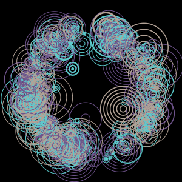
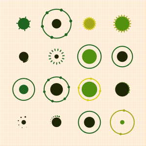

[](https://goreportcard.com/report/github.com/rexposadas/art)
[](https://godoc.org/github.com/rexposadas/art)
[](https://travis-ci.org/rexposadas/art)
[](https://coveralls.io/github/rexposadas/art?branch=master)

# Art
Art is a CLI which makes it easy to generated 2D art in Go.

This CLI makes heavy use of this [repository](https://github.com/jdxyw/generativeart): `github.com/jdxyw/generativeart`.

# Quick start

Build the app and run it:

`go build -o ./art && ./art circles`

That creates a directory called "output" with art you just generated. 

If you are on a macbook you can open the files with `open output/*`. A sample circle image is shown below.




# Using more options 

You can view the options you can have by: 

`./art`


# Other calls you can try 

`./art random-shapes`

`./art perls`


# Sample makefile

There is a sample makefile in the repo. You can use it to generate art.

`make -f sample-Makefile all`

That will generate art for all the calls in the makefile.

# Using a config file
Config files lets you alter the looks of your art. in the input folder you can see this config: 

```json
{
  "out": {
    "dir": "output"
  },
  "canvas": {
    "width": 300,
    "height": 300
  }
}
```

You can set the canvas and the output directory. 

To make use of this config file you can make a call like so: 

`./art circles grid -c 10 -f input/config.json`

That will produce 10 images with the circle config. Here's a sample image: 




# Contributing

To contribute create an issue and/or a pull request.

# Planned Features

[ ] Each image is created with an associated config file. This config file shows what parameters were used when that image was generated. This is helpful if you want to recreate a similar image. (not implemented)

[ ] A flag to indicate the output directory.

[ ] Create s subdirectory indicating the date and time of the run.

[ ] Use Toml files instead of JSON files for config. TOML files are easier to read and are more concise. 


