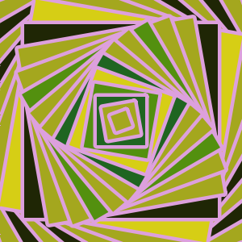

An easy way to generate 2d art with Go.  

# Quick start

`go build -o ./art && art samples`

That creates a directory called "output" with art you just generated. 

If you are on a mac you can open the files with `open output/*.png`

# Using more options 

You can view the options you can have by `art help`

